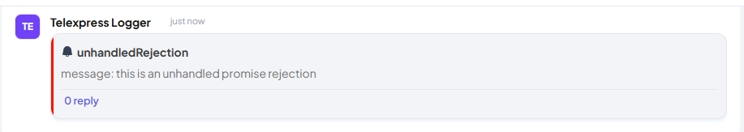

# Telexpress

A lightweight Node.js error monitoring & logging package that sends uncaught exceptions and unhandled rejections to a [Telex](https://telex.im/) channel.

## Installation

```bash
npm install telexpress

```

## Usage

Check [here](https://docs.telex.im/docs/intro#webhooks-on-telex) for instructions on how to create a channel and get the webhook url for that channel.

## Example with Express

```bash
import express from 'express';
import { Logger } from 'telexpress';

const app = express();
const logger = new Logger(process.env.TELEX_CHANNEL_WEBHOOK_URL);

logger.initialize();

app.get('/', (req, res) => {
  console.log('Hi')
});

app.listen(3000, () => {
  console.log('Server is running on port 3000');
});


new Promise((resolve, reject) => {
    reject({message: 'this is an unhandled promise rejection'})

})
throw new Error('this is an uncaught exception')
```

### Uncaugh exception message


### Unhandled rejection message



## License

ISC License

## Author

Zeal Meruwoma
